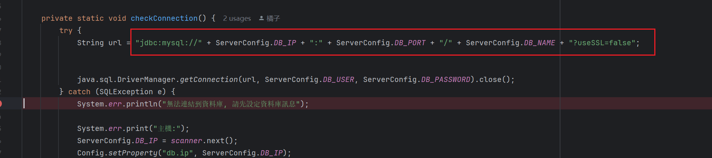

非常感恩作者！目前看到修复的比较好的一个端，部署非常简单解压客户端，一键启动服务端即可。不只是一个简单的端，看得出作者修复的很好，很多东西可以学习。
 
流程：
1. 下载：客户端+服务端：https://t.me/tms245
2. 解压客户端和服务端
3. 安装数据库，导入SQL文件

4. 启动服务端
JDK版本是11， mysql用57版本，

默认的JAR配置会报错，修改了checkDB的逻辑,拼接成完整的jdbc

5. 启动客户端
>需要改成繁体环境，或者向我一样模拟繁体环境登陆。

6. 开始玩耍

几个注意事项：
1. Mysql 57数据库
2. JDK版本为：11
3. 模拟湾湾地区登陆工具：
   https://github.com/InWILL/Locale_Remulator?tab=readme-ov-file#english--%E7%AE%80%E4%BD%93%E4%B8%AD%E6%96%87-1
   如下配置：即可在简体环境登陆。
   

4. 任务管理器 手动杀掉AES检查.等一分钟可能也行