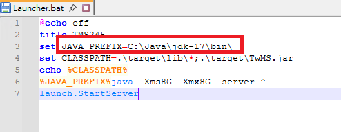

非常感恩作者！目前看到修复的比较好的一个端。不只是一个简单的端，看得出作者修复的很好，很多东西可以学习。

流程：
1. 下载：客户端+服务端：https://t.me/tms245
2. 解压客户端和服务端並导出wz等xml
3. 安装JDK，版本是17
3. 安装MySQL 5.7.44，參數如下
database: playms
username: root
password: 123456

4. 依序导入SQL文件

5. 启动服务端

6. 启动客户端
>需要改成繁体环境，或者向我一样模拟繁体环境登陆。

7. Done

几个注意事项：
1. Mysql 57数据库
默认配置：
ip:127.0.0.1
port:3306
db:playms
user: root
password: 123456

2. JDK版本为：17
3. 模拟湾湾地区登陆工具：
   https://github.com/InWILL/Locale_Remulator?tab=readme-ov-file#english--%E7%AE%80%E4%BD%93%E4%B8%AD%E6%96%87-1
   如下配置：即可在简体环境登陆。
   

4. 任务管理器 手动杀掉AES检查.等一分钟可能也行

5. 常用指令
!刷樂豆點 10000
